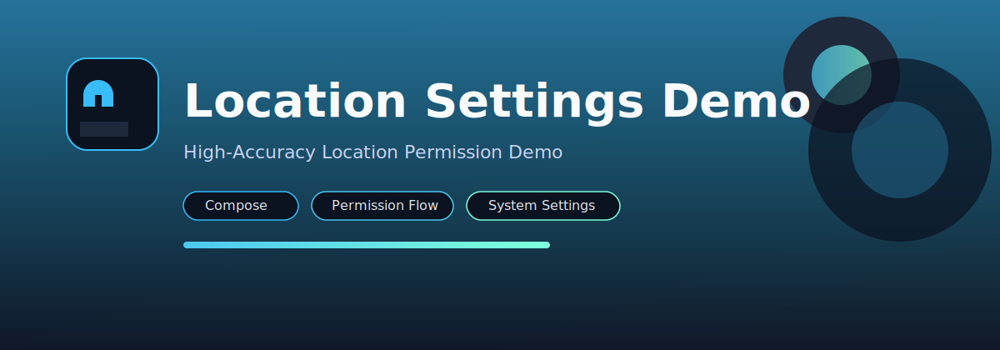

# Location Settings Demo
高精準度定位權限前置引導示範 App

這是一個示範 App，用來引導使用者在使用「高精準度位置」前完成必要設定（截圖為 Android OS 36）：
- 系統定位服務是否開啟
- 定位精確度是否啟用（GPS + 網路）
- App 位置權限是否已授權

本專案採用 Jetpack Compose，並示範在「可顯示系統對話框」與「需導向設定頁」兩種情境下的處理方式。

## 重點特色
- 單一入口畫面即時顯示系統狀態與權限狀態
- 透過 Google Play services 觸發系統定位啟用/精準度提示
- 處理「不再詢問」情境，導向系統設定頁
- Kotlin + Compose + Material 3，程式碼結構簡潔

## Screenshots
以下為 Android OS 36 最新截圖：

<image width=250 src="docs/screenshots/Screenshot_20260128_112039.png"/><image width=250 src="docs/screenshots/Screenshot_20260128_112053.png"/><image width=250 src="docs/screenshots/Screenshot_20260128_112148.png"/>

## 使用流程（Demo Flow）
1. 進入主畫面後顯示三種狀態：位置服務（系統）、高精準度定位、位置權限（App）。
2. 點選「開啟位置服務（系統）」會嘗試彈出系統對話框；若不可用，導向設定頁。
3. 點選「調整高精準度定位」會嘗試要求高精準度；若不可用，導向設定頁。
4. 點選「管理位置權限」會請求 `ACCESS_FINE_LOCATION`，若已選擇不再詢問，改導向設定頁。

## 技術棧
- Kotlin + Jetpack Compose + Material 3
- AndroidX Activity / Lifecycle / Compose
- Google Play services Location
- Min SDK 26 / Target SDK 36

## 權限說明
- `android.permission.ACCESS_FINE_LOCATION`
- `android.permission.ACCESS_COARSE_LOCATION`

本 App 僅示範「權限與設定導流」，不會擷取或上傳定位資料。

## 高精準度定位說明
結論：高精準度定位不是必須，但會影響定位品質與可用性。
- 系統定位服務關閉時，無法取得定位。
- 高精準度關閉時仍可能取得定位，但精準度較差、定位時間較久，室內更容易失敗。
- App 端要取得高精準度定位，需有 `ACCESS_FINE_LOCATION`；高精準度屬於系統層提升品質的設定，不是必備流程。

## 高精準度定位開發流程建議
1. 先向使用者說明使用情境與必要性，再在需要時才請求位置權限。
2. 取得 `ACCESS_FINE_LOCATION`（必要時加上 `ACCESS_COARSE_LOCATION` 做降級處理）。
3. 檢查「位置服務（系統）」是否開啟；未開啟時先引導使用者開啟。
4. 使用 `SettingsClient` 檢查並請求高精準度；若無法顯示系統對話框，導向設定頁。
5. 權限被拒絕時提供替代流程與清楚的下一步（例如前往 App 設定頁）。
6. 取得定位後注意降頻與省電，並在非必要時停止更新。

## 專案結構
- `app/` Android app module
- `app/src/main/java/com/example/locationsetting/` 主要程式碼（`MainActivity.kt`）
- `app/src/main/res/` 資源
- `app/src/test/` 單元測試
- `app/src/androidTest/` 儀器測試

## Build & Run
```bash
./gradlew assembleDebug
./gradlew installDebug
```

建議使用 Android Studio 開啟專案進行執行與除錯。

## Testing
```bash
./gradlew test
./gradlew connectedAndroidTest
./gradlew lint
```

## Roadmap
- 以真實裝置截圖取代示意圖
- 補齊權限流程的 UI 測試
- 增加多語系（EN/JA）

## Contributing
歡迎開 issue / PR。UI 變更請附上截圖或錄影。
